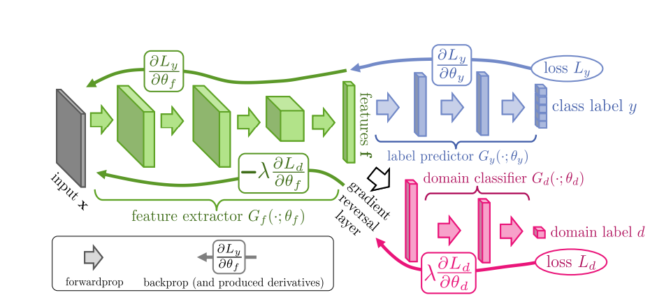
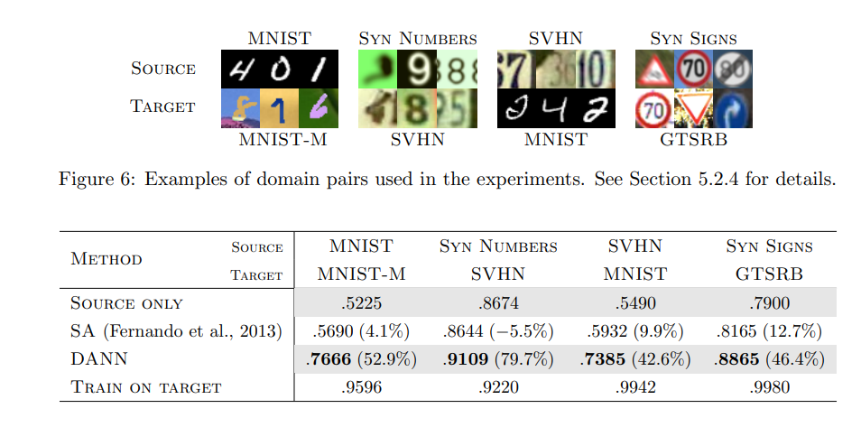
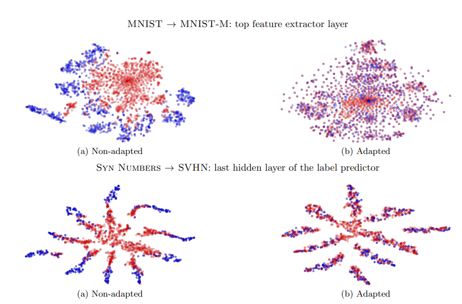

# Domain-Adversarial Training of Neural Networks
## JMLR 2016
[Paper Link](https://jmlr.org/papers/volume17/15-239/15-239.pdf)

Domain adaptation is the task in which we need to perform inference on a target domain, whose distribution is different from the source domain on which the model was trained. 

It can be semi-supervised, in which we have small amount of labelled data from the target domain, or unsupervised, in which we only have unlabelled data from the target domain. This paper deals with the difficult case of unsupervised domain adaptation, although it can easily be extended to the semi-supervised case.

They argue, based on the seminal works ([1], [2]) , that the best domain-invariant classifiers are the ones which are able to predict the labels correctly using representations which are similar for both source and target domain. 

## Architecture

 Their proposed architecture consists of one feature extractor layer, which is connected to one standard cross-entropy based label predictor and one domain classifier (which predicts the domain from which the image is coming).

For the model to adaptable, the feature extractor should give indistinguishable features for both source and target domain (and also distinct features for different class labels). Thus the feature extractor is trained in such a way that minimizes label predictor loss but maximizes domain classifier loss. 

For this they introduce a gradient reversal layer between the feature extractor and domain classifier which behaves as a simple identity transform during forward propogation but multiplies the derivatives by -1 during backprop (so that the feature extractor layers maximise the domain classifier loss instead of minimizing). Rest of the architecture is standard. 

## Key Hyperparameters

They initialise the domain adaptation parameter (λ in the figure) at 0 and gradually change to 1 using a schedule 

$\lambda = \frac{2}{1 + e^{-10p}} - 1$

Where p is a process variable linearly increasing from 0 to 1 as time progresses. They do this to ensure that the feature extractor net does not get much confused by the noisy signal in the beginning.

 Also it is not possible to use normal cross validation in Unsupervised Domain adaptation (as you do not have any labelled data for target domain). Thus they follow a variant of reverse cross validation (originally proposed in [3]). They divide both source and target domain into train and val splits (in 9:1 ratio). They first train a domain-invariant classifier using the labelled source-train and unlabelled target-train splits. They use this classifier to give pseudo labels to the target-val split. Then they again train a domain invariant classifier (with the same hyperparameters as earlier) with the pseudo labelled target-val and source-val without labels. This will give a classifier which can be evaluated on the labels of source-val split. 
 
## Results
They evaluate on several datasets, outperform zero-shot adaptation and also previous baselines by good margins. Some of the results are shown below, although they also evaluate on other datasets such as the Office dataset and also on non-classification settings such as the person-reidentification. 

They also provide t-sne visualisations of the model activations with and without adaptation, and the activations of adapted models are indistinguishable between source and target domains.

 
One insightful failure case is the MNIST -> SVHN case in which their model does not outperform the source-only baseline. SVHN has much more diverse images, and hence it shows that it is difficult to adapt a model trained on a smaller distribution to a larger one.  They note that no approach in their time is able to adapt in the MNIST -> SVHN case.

## References

1)Shai Ben-David, John Blitzer, Koby Crammer, and Fernando Pereira. Analysis of representations for domain adaptation. NIPS, 2006

2)Shai Ben-David, John Blitzer, Koby Crammer, Alex Kulesza, Fernando Pereira, and Jennifer Wortman Vaughan. A theory of learning from different domains. Machine Learning, 2010.

3)Erheng Zhong, Wei Fan, Qiang Yang, Olivier Verscheure, and Jiangtao Ren. Cross validation framework to choose amongst models and datasets for transfer learning. MLKDD, 2010

