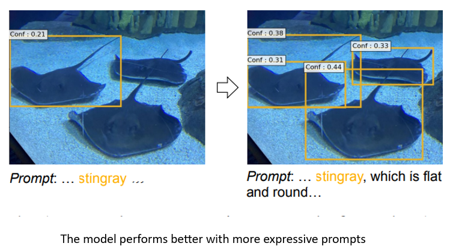

# Grounded Language Image Pre-training 

## CVPR 2022
[Paper Link](https://openaccess.thecvf.com/content/CVPR2022/papers/Li_Grounded_Language-Image_Pre-Training_CVPR_2022_paper.pdf)

## Key Idea

Object detection is the task of detecting regions in an image which correspond to a predefined list of objects. Phrase Grounding is the task of identifying which regions in images correspond to different phrases in a given sentence. In this paper, the authors unify object detection and phrase grounding by passing dot separated list of objects (for object detection) or a sentence caption 
                                        

## Model Architecture

For this task they follow a dual encoder architecture with BERT as a text encoder and a DyHead based vision encoder and a cross-attention based deep fusion between layers so as to capture more low-level interactions between text and image tokens. They used a region-text contrastive loss to learn alignments between text and region tokens and a localization loss for bounding box prediction.

                               
## Training Method
They first Pre-train a teacher model (with Swin-Tiny backbone) on the hand-annotated Gold data. Then they use this teacher model to annotate web-scale image-text data and train a larger student model (with Swin-Large backbone) on the gold + pseudo-labelled data.

One of the most interesting findings of the paper is that the Student model outperforms the Teacher model. The authors argue that the reason for this is the text descriptions of web-scale data are very rich and hence the Teacher model can infer some object categories not seen in training data through the rich text prompt, and those objects become a supervised signal for the student model
             
                                      

                                        
                                        
                                        The model performs better with more expressive prompts
## Results

## Additional Comments
As described above, the model performs better with better prompts. The authors also run experiments with prompt tuning, i.e. learning a vector prompt. In this setting, researchers prepend a learnable vector embedding to the input text embedding, keep the rest of the model frozen and fine-tune the model in a new domain. They show that similar to the findings in NLP literature, prompt tuning rivals full model finetuning, with the gap growing smaller as the model and data size increase

